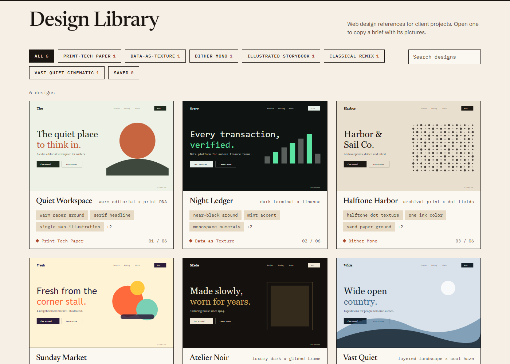
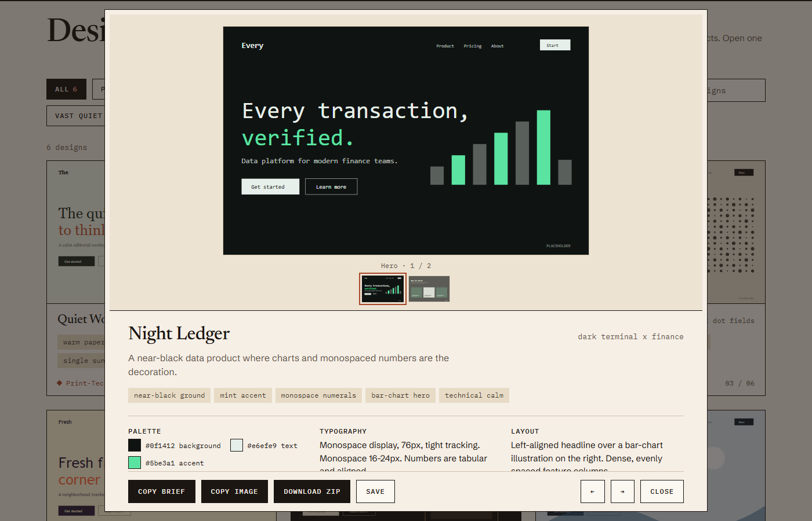

# Design Library

A personal library of web design references. I collect designs I like, describe them in a consistent format, and browse them for inspiration when a new client project starts. When I pick one, I hand it to a fresh Claude Code session as a written brief plus the screenshots, so the session understands the look in words and in pictures.





> The six designs in the repo are placeholders I generated to demo the layout. They have no real source. Real entries come from my own Dribbble collection.

## What it does

- **Browse** a grid of designs with category filters, live search and a saved list.
- **Open** a design to see its screenshots, palette, typography, layout and style notes.
- **Hand off** a design to another Claude session:
  - *Copy brief* copies a structured markdown brief. It lists the image file paths and tells the session to look at them first.
  - *Copy image* puts the current screenshot on the clipboard, ready to paste into a chat.
  - *Download zip* bundles `brief.md` and the images into one file.
- Works offline. Plain HTML, CSS and JavaScript, no build step, no dependencies.

## Run it

Double-click `index.html` to browse.

For *Copy image* and *Download zip*, start the tiny local server instead. It needs [Node.js](https://nodejs.org) 18 or newer:

```
start.bat            # Windows
node server.mjs      # anywhere
```

It opens <http://localhost:4173>. Use `PORT=4180 node server.mjs` if that port is taken.

## Add a design

1. Put the screenshots in `images/<design-id>/`.
2. Copy an entry in `data/designs.js` and fill it in.
3. Reload the page.

An entry looks like this:

```js
{
  id: "night-ledger",
  title: "Night Ledger",
  source: "https://dribbble.com/shots/...",   // or null
  category: "Data-as-Texture",
  descriptor: "dark terminal x finance",
  summary: "One sentence on the feeling.",
  images: [{ file: "images/night-ledger/cover.png", caption: "Hero" }],
  tags: ["near-black ground", "mint accent"],
  colors: [{ role: "background", hex: "#0f1412" }],
  typography: { heading: "...", body: "...", notes: "..." },
  layout: "...",
  style: "...",
  bestFor: ["fintech", "analytics"],
  notes: "..."
}
```

Remove `placeholder: true` from any entry that is a real design.

## Project layout

| Path | Purpose |
| --- | --- |
| `index.html`, `styles.css`, `app.js` | The app |
| `data/designs.js` | The library |
| `images/` | Screenshots, one folder per design |
| `fonts/` | Self-hosted Newsreader, IBM Plex Mono and Schibsted Grotesk |
| `server.mjs`, `start.bat` | Optional local server for image copy and zip |
| `PRODUCT.md` | Who the app is for and what it must do |
| `.claude/` | [Impeccable](https://github.com/pbakaus/impeccable) design skill for Claude Code |

## Design

The interface is a warm paper ground with thin ink borders, serif titles, and monospace for labels and data, so the screenshots stay the loudest thing on the page. It was built and checked with Impeccable, which also provides the anti-pattern detector:

```
npx impeccable detect index.html styles.css app.js
```

## Ideas for later

- Import a Dribbble screenshot and draft the entry automatically.
- Extract the palette from each image.
- Tag a design with the client it was used for.
